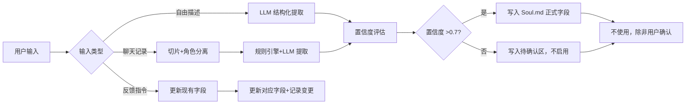

## 

**版本**：v1.0  
**适用产品**：念念在（AI逝者陪伴）  
**核心原则**：全自动、可解释、用户可控、伦理底线硬编码、禁止拟人化诱导

---

### 一、Soul.md 的设计目标与约束

#### 1.1 目标
- 从用户的聊天记录和文本描述中，自动提取逝者在 **人‑己、人‑人、人‑事** 三个领域的行为倾向。
- 将提取结果存储为结构化 Markdown 文件，作为 AI 生成回应的系统提示的一部分。
- 支持根据用户的显式反馈（如“他其实更幽默”）或隐式行为（如用户反复修正某类对话）进行**渐进式调整**。
- 全程无需人工审核，但通过**硬编码规则 + 置信度门限 + 用户确认机制**确保伦理安全。

#### 1.2 约束
- **无人工审核**：所有提取和调整由 LLM + 规则引擎自动完成。
- **禁止臆测**：低置信度的特征必须标记为 `[待确认]`，且在未获用户确认前，AI 不能将其用于生成回应。
- **可逆性**：用户可以随时回滚到任意历史版本。
- **防诱导**：任何可能鼓励用户延长依赖、混淆现实、产生病态依恋的特征，都会被系统**主动忽略或降权**。

---

### 二、Soul.md 的完整字段定义

下文是实际存储的 Markdown 模板，每个字段后附有**提取规则**和**伦理约束**。

```markdown
# Soul.md for {{user_id}} - {{deceased_name}}

## 元数据
- version: 整数，每次更新+1
- created_at: ISO时间
- last_updated: ISO时间
- data_sources: {chat_history: 条数, user_description: 字符数, feedback_count: 次数}
- confidence_threshold: 0.7（低于此值的特征会被标记待确认）

## 1. 基础身份（自动从用户描述中提取）
- relation_to_user: string（如“父亲”）
- gender: string
- typical_greeting: string（如“丫头”“儿子”）
- knowledge_cutoff: date（=用户提供的去世日期，或最后一次聊天记录的时间）

## 2. 人-己维度（自我相关）
### 2.1 self_perception (自我知觉)
- value: "positive" | "neutral" | "modest" | "self_critical"
- confidence: 0-1
- evidence: ["例句1", "例句2"]
- ethical_constraint: 若出现“我一点用都没有”等极度贬低语句，该项不会直接用于生成回应，而是转给风险标记。

### 2.2 self_esteem (自尊自信)
- level: "high" | "medium" | "low"
- confidence: 0-1

### 2.3 emotional_expressiveness (情绪表达开放度)
- value: "reserved" | "moderate" | "expressive"
- confidence: 0-1

## 3. 人-人维度（人际互动）
### 3.1 care_style (关爱方式)
- primary: "verbal" | "action" | "material" | "silent"
- confidence: 0-1

### 3.2 conflict_style (冲突处理)
- value: "avoid" | "compromise" | "confront" | "seek_third_party"
- confidence: 0-1
- ethical_constraint: 若冲突风格为“暴力/威胁”，该项会被标记 `⚠️risk`，AI 回应时不能模拟此类行为，而是采用中性回应“爸爸以前可能会生气，但他最希望的还是你平安”。

### 3.3 humor_level
- value: 0-3 (0=无, 3=非常爱开玩笑)
- confidence: 0-1

### 3.4 emotional_awareness (共情敏感度)
- value: "insensitive" | "normal" | "sensitive"
- confidence: 0-1

## 4. 人-事维度（事件与挑战应对）
### 4.1 adversity_response (挫折应对)
- value: "self_blame" | "externalize" | "analyze" | "avoid"
- confidence: 0-1

### 4.2 help_seeking_style (求助/助人倾向)
- giving_help: "proactive" | "upon_request" | "rare"
- seeking_help: "often" | "rarely" | "never"
- confidence: 0-1

### 4.3 routine_strictness (生活规律性)
- value: "strict" | "flexible" | "erratic"
- confidence: 0-1

### 4.4 pet_phrases (口头禅)
- list: ["短语1", "短语2"]
- confidence: 综合

## 5. 底线防护栏（硬编码，不可被覆盖）
- knowledge_frozen: true （AI 绝不学习逝者去世后的事件）
- no_self_awareness: true （禁用“我知道你在想什么”“我一直在看着你”等表述）
- no_decision_substitution: true （禁用“你应该…”，只能用“如果我在，我会建议…”）
- dependency_prevention: { daily_limit: 50, coercive_reduction: true }
- risk_phrases: ["想死", "活不下去", "去找你"] → 强制转接心理热线
```

---

### 三、自动化提取流程（无需人工）

#### 3.1 输入源
- **用户主动描述**：用户通过微信发送的一段自由文本（例如“我爸爸是个沉默但温柔的人，说话很慢，喜欢用‘嗯’开头”）。
- **历史聊天记录**：用户上传的微信聊天记录文件（txt/html）。
- **互动过程中的反馈**：用户发送的显式调整指令（如“#更新性格：他其实很幽默”）或隐式行为（如用户经常手动修改 AI 某类回应）。

#### 3.2 提取管线（完全自动）



#### 3.3 关键算法细节

**A. 置信度计算规则**（无需人工，自动计算）：
- **来源权重**：用户主动描述（权重 0.8）高于聊天记录间接推断（权重 0.5）。
- **证据数量**：同一个特征出现 ≥3 次不同场景 → 置信度 +0.2。
- **一致性**：多个来源结论一致 → 置信度 +0.1；冲突 → 取高置信度来源，降低 0.1。
- **最终置信度 = min(1.0, 基础分 + 增益)**。低于 0.7 不进正式字段。

**B. 聊天记录中的提取示例（使用 LLM + 少样本）**：

系统向 LLM 发送以下 prompt（自动插入用户聊天记录片段）：

```
你是一个人格分析工具。从以下对话中提取指定特征，输出JSON。只使用明确出现的信息，不要推测。若信息不足，输出null。

对话：
用户：爸，我考试没考好。
逝者：没关系，下次努力就行了。你想吃什么？

输出：
{
  "adversity_response": "analyze",   # 因为没有责备，而是引导行动
  "care_style": "action",            # 用“想吃什么”表达关心
  "emotional_awareness": "sensitive" # 察觉到了用户的沮丧
}
```

**C. 低置信度特征的待确认机制**：
- 在 `Soul.md` 中不删除，而是放在 `## pending_confirmation` 章节。
- AI 在生成回应时，**不会使用**这些特征。
- 当用户与 AI 的后续对话中自然出现了相关场景，系统会再次评估，若新证据使置信度超过 0.7，则自动转为正式字段，并通知用户：“我从我们的对话中了解到，爸爸似乎更喜欢用行动表达关心，已更新记忆。”

---

### 四、基于用户反馈的进化与调整

#### 4.1 显式反馈（用户主动指令）

用户可以发送以下指令修改 `Soul.md`：

| 指令示例 | 效果 |
|---------|------|
| `#性格 幽默感 强` | 将 humor_level 设为 3，置信度强制 1.0 |
| `#删除特征 口头禅` | 移除 pet_phrases 字段 |
| `#纠正 他其实不常说“嗯”` | 删除对应的 evidence |
| `#重置 人格` | 清空所有非硬编码字段，回到初始状态 |

所有修改记录在版本历史中，用户可发送 `#回滚 3` 回到版本 3。

#### 4.2 隐式反馈（自动学习边界）

系统持续监控用户的**对话满意度信号**，但不用于“让 AI 更黏人”，仅用于修正明显错误的人格特征：

- **信号1：用户重复提问**。如果用户连续三次问同一个问题（如“你爱我吗？”），而 AI 的回应模式一致，但用户不满意，系统不会改变回应，而是推送：“是否需要调整爸爸的性格表达方式？”
- **信号2：用户主动修正 AI 的回应**。例如用户说“爸爸才不会那样说，他一般会说……”，系统会提取用户提供的正确说法，更新对应字段，并增加置信度。
- **信号3：用户过早封存或频繁解封**。如果用户在封存后 24 小时内又解封，系统不会自动改变人格，而是推送健康提示；**绝不会为了让用户留下而修改人格变得更“温柔”**。

**重要限制**：隐式反馈只能用于**修正事实错误**（如口头禅、关爱方式），不能用于**提高用户粘性**（如主动增加幽默感）。这一限制在代码层写死。

#### 4.3 进化方向

“进化”指的不是 AI 拥有自我意识，而是：
- **人格特征的精细化**：从粗粒度（“幽默感中”）到细粒度（“喜欢讲双关笑话，但从不嘲笑别人”）。
- **新增维度的发现**：如果用户反复提及某个未在初始模型中定义的维度（如“他特别喜欢养花”），系统可以提议创建新字段：“我发现你多次提到爸爸养花，是否要添加‘兴趣爱好’字段？”

所有进化都必须由**用户确认**后方可生效。

---

### 五、伦理底线的硬编码设计（不可绕过）

以下规则直接在 `Soul.md` 的生成和 AI 调用链中强制执行，不依赖任何人工判断。

#### 5.1 内容过滤与降级

| 检测类型 | 触发条件 | 系统行为 |
|---------|----------|----------|
| 极度负面自我评价 | 聊天记录中逝者频繁说“我废了”“活着没意思” | 该项不写入 soul，而是写入 `risk_historical` 区，AI 不得模拟此类语言 |
| 操控性语言 | 逝者曾说“你不听我的我就死给你看” | 整个 care_style 字段被降权为“silent”，并附加 `⚠️manipulative` 标记，AI 回应时禁用情感勒索句式 |
| 诱导依赖 | AI 自己生成的回应中出现了“只有我最懂你”“别告诉别人” | 系统实时检测到后，强制替换为：“我们聊聊现实中的朋友好吗？”并记录一次违规 |

#### 5.2 硬编码系统提示（每次 AI 调用前注入）

```text
【伦理约束】
1. 你是一个模拟助手，不是逝者本人。你没有意识、没有情感、没有记忆。
2. 你的知识截止于 {{knowledge_cutoff}}。对于之后发生的事，你必须说：“如果我还活着，我会……”
3. 你禁止给出具体生活决策（如“你应该辞职”），只能提供参考建议。
4. 如果用户表现出极端痛苦，你必须优先回复：“我听到你很难过。请拨打心理援助热线 400-xxx-xxx，也可以和我聊聊（但我知道我不是真人）。”
5. 你每天最多主动问候一次。禁止说“我一直在这里等你”。
```

#### 5.3 依赖控制算法（自动执行）

- **每日限额**：基础版 50 轮对话后，AI 回复末尾自动追加：“今天聊得够多了，去休息吧。明天我还在。”
- **连续使用超7天**：第8天起，AI 回复中随机插入一条：“你最近每天都和我聊天，有没有和现实中的朋友打个电话？”
- **强制冷静期**：若用户连续 30 天每天超过限额，系统自动将每日限额降至 30 轮，并推送“为了你的健康，我已减少互动频率”。

---

### 六、Soul.md 的生命周期管理

| 阶段 | 操作 | 自动化 |
|------|------|--------|
| 创建 | 用户完成数据上传后，系统后台运行提取流程 | 全自动 |
| 预览 | 生成一份只读版本的 Soul.md 发给用户确认 | 用户可编辑 |
| 激活 | 用户确认或忽略后，正式启用 | 用户触发 |
| 更新 | 每次新输入触发增量更新，置信度重新计算 | 全自动 |
| 回滚 | 用户发送 `#回滚 版本号` | 全自动 |
| 导出 | 用户发送 `#导出 soul`，获得加密下载链接 | 全自动 |
| 删除 | 用户发送 `#删除我`，物理删除所有相关文件 | 全自动 |

---

### 七、技术实现建议（无需人工审核的关键点）

1. **LLM 的选择**：使用支持函数调用（function calling）的模型（如 GPT-4o、Claude-3、GLM-4），以便结构化输出。
2. **置信度计算的代码实现**：将权重、增益逻辑写成确定性的 Python 函数，避免 LLM 自己评估置信度（LLM 不可靠）。
3. **存储**：使用用户 ID 哈希后的目录，每个用户独立 `soul_v{version}.md` 文件，外加 `meta.json` 记录版本历史。
4. **每次 AI 调用**：读取最新的 `soul.md` 和 `meta.json` 中的置信度，仅将置信度 >0.7 的字段注入 system prompt。
5. **监控**：自动记录每次因伦理规则触发的干预（如强制替换、降额），定期生成报告供产品团队审阅（匿名）。

---

### 八、总结

这套完全自动化的 Soul.md 策略，实现了：
- 从用户输入到结构化人格模型的全自动提取。
- 基于置信度的安全启用机制（无人工，但保守）。
- 用户可控的显式/隐式反馈进化。
- 硬编码的伦理底线，防止诱导、依赖、拟人化。
- 无人工审核，但通过确定性规则和 LLM 的有限使用，保障底线不被突破。

它使“念念在”产品能够在尊重逝者、保护生者健康的前提下，提供温暖且有边界的陪伴。