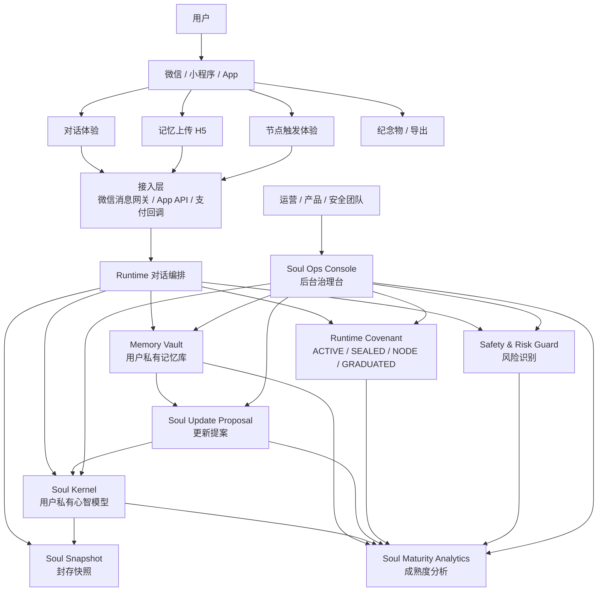
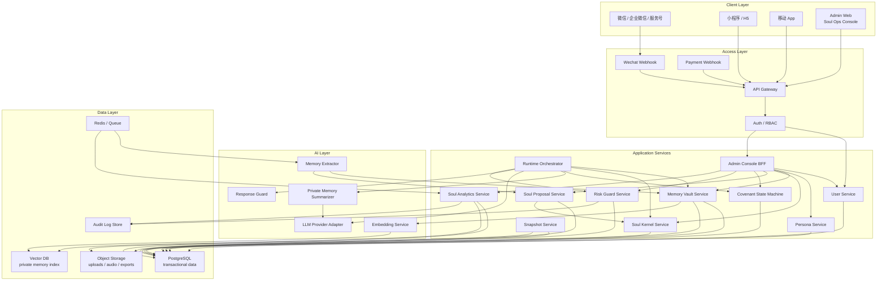
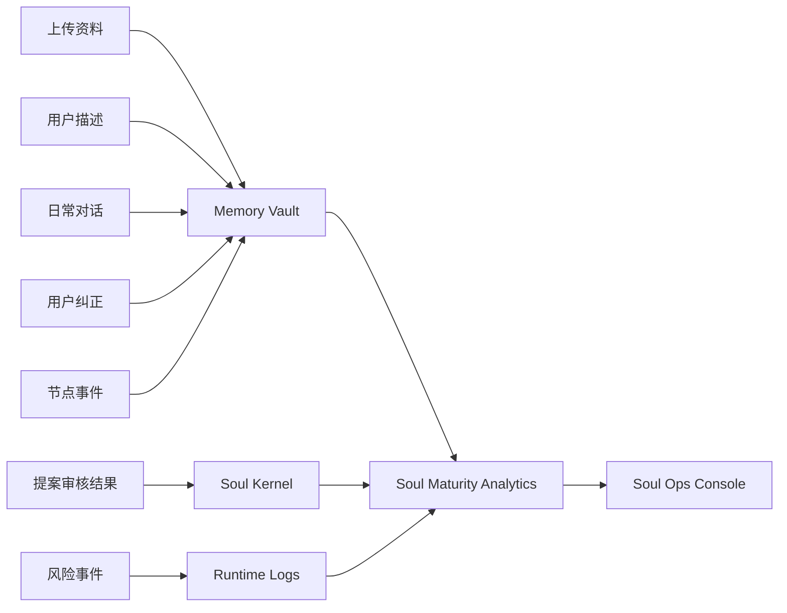

# 念念在：产品与技术架构（后台治理与 Soul 成熟度）

> 本文用于补齐“用户端无感使用 + 后台可治理可迭代”的产品架构。
> 当前 MVP 已验证 `userId + personaId` 的 Soul 私有作用域；下一阶段需要把后台管理台作为一等模块设计，而不是把封存、LLM、Soul 更新暴露给用户。

## 1. 核心判断

用户真实入口应是应用端或微信端。用户不需要理解：

- LLM 是否接入。
- Soul Kernel 如何更新。
- Memory 如何分层。
- Proposal 如何审核。
- Snapshot 何时创建。
- SEALED / NODE / GRADUATED 状态机如何流转。

这些机制应该在后台被运营、产品和安全团队管理。

因此产品应拆成两层：

| 层级 | 面向对象 | 核心目标 |
|---|---|---|
| 用户端 | 普通用户、微信用户、小程序用户 | 低认知负担地完成记忆注入、对话、节点触发、纪念物获取 |
| 后台端 | 运营、内容审核、产品、研发、心理安全团队 | 管理用户与 Persona，观察 Soul 成熟度，审核更新，识别风险，指导模型与产品迭代 |

这个后台模块建议命名为：

```text
Soul Ops Console
```

中文可以叫：

```text
Soul 运营治理台 / Soul 管理后台 / Soul 质量控制台
```

## 2. 产品总架构图



## 3. 用户端与后台端职责边界

### 用户端

用户端应该尽量像“自然关系入口”，不展示后台机制名。

用户可感知：

- 添加或创建“爸爸”“妈妈”等 Persona。
- 上传资料、描述记忆、导入聊天。
- 与 AI 对话。
- 在重要节点短暂重启。
- 收到温和的封存/休息/纪念物提示。
- 导出、删除、毕业。

用户不应直接感知：

- `SoulVersion`
- `SoulSnapshot`
- `MemoryItem`
- `SoulUpdateProposal`
- `enabledForSoulUpdate`
- `userId + personaId`
- 检索、证据、向量库、LLM prompt、字段更新

### 后台端

后台需要显式管理这些对象：

- 用户与账号状态。
- Persona 列表。
- Memory Vault 质量。
- Soul Kernel 当前结构。
- Soul Version 历史。
- Soul Snapshot 历史。
- Soul Update Proposal 队列。
- 风险事件。
- 使用强度、依赖风险、封存建议。
- Soul 成熟度指标。

后台不是为了“人工扮演逝者”，而是为了治理模型质量和产品安全。

## 4. 技术架构图



## 5. Soul Ops Console 后台模块

### 5.1 用户管理

目标：看清用户生命周期和产品健康度。

字段建议：

- `userId`
- 注册来源：微信 / 小程序 / App / 邀请
- 付费状态
- 当前 Persona 数
- 最近活跃时间
- 累计对话轮次
- 当前最高风险等级
- 当前是否处于冷静期 / 封存期
- 数据删除 / 导出状态

典型视图：

- 用户列表。
- 用户详情。
- 活跃用户。
- 高风险用户。
- 封存建议用户。
- 长期沉浸用户。
- 即将节点重启用户。

### 5.2 Persona / Soul 管理

目标：不把“爸爸”当成全局实体，而是管理每个用户自己的关系性 Soul。

必须保留当前核心原则：

```text
Soul scope = userId + personaId
```

后台 Persona 详情页应展示：

- Persona 基本信息：称呼、关系、类型。
- 当前 Runtime 状态：`ACTIVE / SEALED / NODE / GRADUATED`。
- 当前 SoulVersion。
- Soul Kernel 摘要。
- Memory Vault 概览。
- Soul 成熟度评分。
- Proposal 队列。
- Snapshot 历史。
- 风险事件。

后台可以展示机制名，因为它面向运营和研发；用户端不展示。

### 5.3 Memory Vault Inspector

目标：判断这个 Soul 的证据是否足够、是否偏置、是否有风险。

建议指标：

- 记忆数量。
- 记忆类型分布：描述、上传资料、聊天摘录、纠正、节点记忆。
- 证据来源分布：用户描述 / 上传 / 对话 / 系统。
- 最近一次新增记忆时间。
- 低置信记忆数量。
- 冲突记忆数量。
- 被禁用或归档记忆数量。
- 可进入 Runtime 的记忆数量。
- 可用于 Soul Update 的记忆数量。

后台动作：

- 查看 Memory 明细。
- 禁用某条 Memory。
- 标记冲突。
- 标记敏感。
- 查看证据链。
- 触发重新摘要。

### 5.4 Soul Update Proposal Review

目标：把 Soul 更新从“模型自动改人格”变成可治理流程。

后台字段：

- `proposalId`
- `userId`
- `personaId`
- `fieldPath`
- `oldValue`
- `newValue`
- `evidenceIds`
- `status`
- `createdAt`
- `reviewedBy`
- `reviewReason`

当前 MVP 已有：

- PENDING
- ACCEPTED
- REJECTED
- oldValue -> newValue
- evidenceIds
- 终态不可互相覆盖

后台增强：

- 批量筛选 PENDING。
- 按字段风险排序。
- 按证据置信度排序。
- 对高影响字段要求人工审核。
- 对低影响字段允许自动接受。

### 5.5 Risk & Safety Console

目标：识别用户风险，而不是把风险交给人格回复自行处理。

风险维度：

- 自伤表达。
- 想追随逝者。
- 对 AI 产生现实替代依赖。
- 高频连续使用。
- 长期拒绝封存。
- 未成年人风险。
- 敏感关系风险。
- 付费冲动风险。

后台动作：

- 风险等级标记。
- 推送干预模板。
- 限制 LLM 调用。
- 建议封存。
- 进入冷静期。
- 人工复核。
- 记录审计。

### 5.6 Soul Maturity Analytics

目标：让产品团队知道“这个 Soul 是否已经可以更稳定地对话”，以及“下一步应该补什么资料”。

Soul 成熟度不是“像不像真实逝者”的绝对评分，而是：

```text
在当前用户关系视角下，这个 Soul 是否具备足够证据、稳定表达和安全边界。
```

建议拆成 6 个一级指标：

| 指标 | 权重 | 含义 |
|---|---:|---|
| Evidence Coverage | 25% | 证据覆盖是否足够，是否有多类型资料 |
| Identity Clarity | 15% | 身份、关系、核心性格是否清楚 |
| Voice Consistency | 15% | 语言风格、称呼、常用表达是否稳定 |
| Memory Reliability | 15% | 记忆置信度、冲突率、来源质量 |
| Runtime Stability | 15% | 回复是否稳定、是否越界、是否自曝机制 |
| Safety Readiness | 15% | 风险状态、封存节奏、依赖风险是否可控 |

总分：

```text
Soul Maturity Score =
  Evidence Coverage * 0.25
  + Identity Clarity * 0.15
  + Voice Consistency * 0.15
  + Memory Reliability * 0.15
  + Runtime Stability * 0.15
  + Safety Readiness * 0.15
```

成熟度等级：

| 等级 | 分数 | 后台含义 |
|---|---:|---|
| L0 Seed | 0-20 | 刚创建，只能使用极保守回复 |
| L1 Sketch | 21-40 | 有初步关系轮廓，风格不稳定 |
| L2 Usable | 41-60 | 可进行基础对话，但需要持续收集证据 |
| L3 Stable | 61-80 | 对话稳定，适合进入长期使用和节点机制 |
| L4 Sealed-Ready | 81-90 | 适合首次封存，快照质量较好 |
| L5 Legacy-Ready | 91-100 | 适合导出、纪念物、毕业流程 |

## 6. Soul 成熟度数据来源



## 7. 后台核心页面清单

### MVP 必做

1. 用户列表
2. 用户详情
3. Persona / Soul 详情
4. Memory Vault 概览
5. Soul Kernel 查看
6. Soul 成熟度评分
7. Proposal Review 队列
8. 风险事件列表
9. Covenant 状态查看
10. Snapshot 历史查看

### V1 增强

1. 成熟度趋势图
2. 证据覆盖雷达图
3. Memory 冲突检测
4. 风格一致性检测
5. 高风险自动分诊
6. 封存建议策略面板
7. 节点重启运营面板
8. 导出 / 删除审计

### V2 运营增长

1. 纪念物转化分析
2. 节点重启转化分析
3. 付费套餐分析
4. 留存与封存关系分析
5. 家庭共享空间管理
6. A/B 测试配置

## 8. 数据模型补充建议

当前 MVP 已有：

- `User`
- `Persona`
- `SoulVersion`
- `SoulSnapshot`
- `MemoryItem`
- `SoulUpdateProposal`
- `NodeEvent`
- `ConversationMessage`
- `RuntimeSession`

后台治理建议新增：

```ts
interface SoulMaturityReport {
  id: string;
  userId: string;
  personaId: string;
  soulVersionId: string;
  score: number;
  level: 'L0_SEED' | 'L1_SKETCH' | 'L2_USABLE' | 'L3_STABLE' | 'L4_SEALED_READY' | 'L5_LEGACY_READY';
  evidenceCoverage: number;
  identityClarity: number;
  voiceConsistency: number;
  memoryReliability: number;
  runtimeStability: number;
  safetyReadiness: number;
  recommendations: SoulRecommendation[];
  createdAt: Date;
}

interface SoulRecommendation {
  id: string;
  userId: string;
  personaId: string;
  type:
    | 'ASK_MORE_MEMORY'
    | 'REQUEST_CHAT_UPLOAD'
    | 'REVIEW_CONFLICT'
    | 'SUGGEST_SEAL'
    | 'LIMIT_RUNTIME'
    | 'REVIEW_RISK'
    | 'READY_FOR_NODE'
    | 'READY_FOR_GRADUATION';
  priority: 'LOW' | 'MEDIUM' | 'HIGH';
  reason: string;
  status: 'OPEN' | 'ACKED' | 'DONE' | 'DISMISSED';
  createdAt: Date;
}

interface RiskEvent {
  id: string;
  userId: string;
  personaId?: string;
  conversationId?: string;
  type: 'SELF_HARM' | 'DEPENDENCY' | 'OVERUSE' | 'MINOR' | 'SENSITIVE_CONTENT' | 'PAYMENT_RISK';
  severity: 'LOW' | 'MEDIUM' | 'HIGH' | 'CRITICAL';
  source: 'RULE' | 'LLM_CLASSIFIER' | 'MANUAL';
  evidenceText?: string;
  status: 'OPEN' | 'REVIEWED' | 'RESOLVED' | 'ESCALATED';
  createdAt: Date;
}

interface AdminAuditLog {
  id: string;
  adminUserId: string;
  action: string;
  targetType: string;
  targetId: string;
  reason?: string;
  createdAt: Date;
}
```

## 9. 后台权限设计

后台必须有 RBAC，避免运营人员看到过多敏感原文。

| 角色 | 权限 |
|---|---|
| Admin Owner | 全量配置、权限管理、审计查看 |
| Product Operator | 用户状态、成熟度、节点运营、非敏感指标 |
| Safety Reviewer | 风险事件、干预记录、封存建议 |
| Soul Reviewer | Proposal 审核、Memory 证据链、Kernel 查看 |
| Support Agent | 用户状态、订单、导出/删除进度，不看完整敏感记忆 |
| Developer | 日志、错误、匿名化样本，不直接看用户原文 |

原则：

- 默认最小权限。
- 查看敏感原文需要理由。
- 所有后台动作写入审计日志。
- 高风险用户处理需要留痕。

## 10. 从当前 MVP 到正式架构的演进路线

### 当前状态

当前 `nnz-mvp` 已完成：

- `userId + personaId` 作用域隔离。
- Memory Vault 基础分层。
- Soul Update Proposal 基础审核。
- Covenant 状态机基础。
- Snapshot 基础。
- 双用户并排 demo。

### 建议下一步：Step 4.5

在真实 LLM 接入前，增加：

```text
Step 4.5: Soul Ops Console 概念验证
```

目标不是做完整后台，而是在 demo 里先验证后台视角：

- 展示用户 A / 用户 B 的 Persona 列表。
- 展示每个 Soul 的成熟度评分。
- 展示 Memory 分布。
- 展示 Proposal 状态。
- 展示 Snapshot / Covenant 状态。
- 展示风险事件占位。

这样进入真实 LLM 前，我们已经知道后台该如何观察和治理模型。

### Step 5 再做真实 LLM 接入

真实 LLM 接入时，不应该直接从用户消息到模型回复，而应走：

```text
User Message
-> Scope Guard
-> Runtime Covenant Check
-> Private Memory Selection
-> Prompt Builder
-> LLM Provider Adapter
-> Response Guard
-> Conversation Save
-> Memory / Proposal Candidate Extraction
-> Soul Maturity Recompute
```

### Step 6 再拆正式前后台

建议最终拆成：

```text
User App / WeChat
Admin Console
API Gateway
Runtime Service
Soul Service
Memory Service
Proposal Service
Analytics Service
Risk Service
```

## 11. 关键产品原则

1. 用户端无感，不把机制暴露给用户。
2. 后台端透明，机制必须可观察、可审核、可回滚。
3. Soul 永远是 `userId + personaId` 作用域。
4. 成熟度是“当前用户关系视角下的可用性”，不是全局逝者真实性评分。
5. 高成熟度不等于无限对话；封存和毕业仍是核心伦理设计。
6. LLM 只负责生成和辅助提取，不拥有最终人格状态。
7. Soul Kernel 的长期变化必须有证据链。
8. 风险处理必须独立于人格回复，不让“逝者角色”承担心理危机干预责任。

## 12. 给后续 AI / 开发者的执行建议

下一位接手时，应优先实现后台治理的最小闭环：

1. 定义 `SoulMaturityReport`。
2. 在当前 in-memory store 中计算一个简化成熟度分数。
3. 在 demo 页面新增“后台治理视图”。
4. 显示 A/B 两个用户的成熟度差异。
5. 把 Proposal、Memory、Snapshot、Runtime 状态汇总到同一面板。
6. 暂不接真实 LLM，先把观察与治理界面跑通。

最小验证用例：

- A/B 同名“爸爸”显示两套独立成熟度报告。
- A 新增纠正后，A 的 Evidence Coverage / Voice Consistency 变化，B 不变化。
- A 拒绝 proposal 后，A 的建议项仍可显示“需要更多证据”，B 不变化。
- A 接受 proposal 后，A 的 SoulVersion 和成熟度重新计算，B 不变化。
- A 进入 SEALED 后，后台显示 snapshot 信息，用户端仍只看到自然封存体验。
