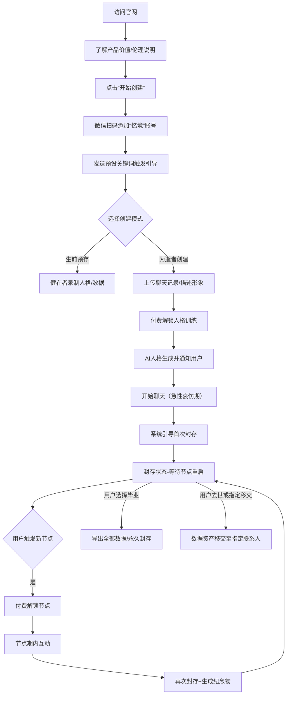

## 

### 一、产品概述

**产品名称（暂定）**：忆境 · 时光信使

**核心价值**：帮助用户在失去亲人后，通过微信原生聊天界面与AI复刻的虚拟人格进行有边界、有仪式的互动，并在人生重要节点“重启封存”，最终实现健康的告别与记忆资产传承。

**产品形态**：
- **展示官网**：PC/移动端自适应网页，说明产品价值、流程、伦理承诺，引导注册与付费。
- **微信账号**：一个企业微信/个人微信服务号（或微信客服接口），用户添加为好友后，通过对话式交互完成数据注入、人格创建、聊天互动、封存/重启等全流程。所有对话均在微信原生界面完成，无需安装额外App。

**技术架构简述**：
- 后端：LLM（如GPT-4/Claude/国内大模型）+ 语音克隆（可选）+ 向量数据库（存储聊天记录与人格向量）
- 前端：响应式官网 + 微信消息接口（通过企业微信API或微信对话开放平台实现自动回复）

---

### 二、用户完整流程图

---

### 三、官网设计（展示产品价值 + 引导注册）

#### 3.1 页面结构（单页滚动式）

**第一屏：Hero区**
- 主标题：**“让爱有处安放，让告别有期”**
- 副标题：为失去亲人的你，在微信里重建一个有温度、有边界、有仪式感的记忆伙伴。
- CTA按钮：**“开始创建 →”**（跳转至注册流程说明）
- 信任标识：心理咨询师协会推荐、数据加密认证、伦理承诺徽章。

**第二屏：产品核心价值（三大亮点）**
- **原生微信体验**：无需下载App，添加好友即聊，就像他/她从未离开。
- **记忆封存 · 节点重启**：在重要人生时刻（婚礼、生子、成功）短暂重逢，其余时间安静守护，避免沉溺。
- **自主告别与传承**：你可以选择在合适时毕业，或将数字记忆作为资产留给下一代。

**第三屏：如何工作（四步引导）**
1. **扫码添加** → 2. **注入记忆**（上传聊天记录/描述形象） → 3. **AI人格生成**（24小时内） → 4. **开启对话与封存**
- 每步配简单插图。

**第四屏：伦理与安全承诺（核心差异化）**
- 我们不希望您永远依赖我们。
- 健康使用提醒、心理援助通道、数据完全由您控制、毕业机制。
- 引用心理学专家语录：“健康的哀伤需要持续性联结，但不需要无限沉溺。”

**第五屏：定价方案**
- 轻量版（文本）：¥49/月 或 ¥299/年（含基础人格+300轮/月）
- 标准版（语音）：¥99/月 或 ¥599/年（含语音克隆+1000轮/月）
- 节点解锁包：¥49/节点（单次3天）
- 年卡（无限节点）：¥299/年
- 一次性买断（终身访问）：¥2,999（含所有功能，无节点限制）
- 强调：首月免费体验基础版（限500轮）。

**第六屏：用户故事/媒体评价**
- 匿名案例：“我在婚礼前重启了爸爸的AI，他的祝福让我觉得他真的在场。”

**第七屏：常见问题**
- 问：我的聊天记录安全吗？答：银行级加密，可随时删除。
- 问：AI会不会越来越像真人？答：我们刻意限制了学习能力，确保不会产生依赖。
- 问：我如何彻底删除？答：随时在微信对话中输入“#永久删除”即可。
- 等等。

**页脚**：微信二维码（用于添加好友）、客服入口、伦理委员会邮箱、备案号。

#### 3.2 注册与付费引导流程（官网→微信）

1. 用户点击“开始创建” → 弹窗显示微信二维码，提示“请使用微信扫码添加【忆境】为好友”。
2. 扫码后自动发送欢迎语（见下文微信交互设计）。
3. 用户完成微信内创建流程后，官网自动检测（通过回调或用户手动确认）跳转至“成功创建”页面，展示后续指引。

---

### 四、微信账号交互设计（核心产品形态）

#### 4.1 账号基础设定
- **头像**：柔和色调的简笔画信封/记忆树叶。
- **昵称**：忆境 · 时光信使
- **签名**：我会安静等你，也教你放手。
- **自动回复**：支持关键词匹配 + LLM意图识别。

#### 4.2 新用户引导对话流

用户添加好友后，自动发送：

> 🌱 你好，我是忆境。  
> 我将帮助你创建一个属于你心中那个人的AI记忆伙伴。  
> 整个过程需要你提供一些信息，所有数据都会加密保存，你也可以随时彻底删除。  
> 
> 请选择你的身份（发送数字即可）：  
> 1️⃣ 我失去了亲人，想为他/她创建AI  
> 2️⃣ 我想为自己提前创建一份“记忆档案”（生前预存）  
> 3️⃣ 我只是想了解，暂不创建

**根据选择分支**：

**分支1（为逝者创建）**：
> 请先给我一点关于他/她的基础信息：  
> - 称呼（例如：爸爸、妈妈、老公）  
> - 性别  
> - 大概年龄（或者去世时的年龄）  
> - 你们的关系  
> 
> 你可以一次发送：“爸爸，男，65岁，女儿”

**收集完基础信息后**：
> 接下来最重要的一步：  
> **请用一段话，向我描述你心中他/她的形象** —— 比如性格特点、说话风格、常用口头禅、对什么话题特别热心、有哪些小习惯。这段描述会很大程度上决定AI的人格。  
> 📝 例如：“我爸爸是个沉默但温柔的人，说话很慢，喜欢用‘嗯’开头，总担心我吃不好，从来不发火，但会说‘你自己拿主意’。”  
> 
> 请直接发送你的描述。

用户发送后保存为人格种子提示词。

> 收到。现在你可以上传你们的聊天记录了（可选，但强烈推荐）。  
> 请发送微信聊天记录的导出文件（txt或html格式），或者直接粘贴文本。  
> 我们只读取对话内容，不存储任何其他信息。如果你不方便上传，只凭上面的描述也可以创建基础版。  
> 发送“跳过”则不使用聊天记录。

用户上传文件或粘贴文本后，系统提示：
> 已收到。数据量约XXX条。  
> 现在需要付费解锁AI人格训练。基础文本版训练费 ¥49（永久买断）或选择订阅模式。请点击支付链接：[链接]  
> 支付完成后，我会在24小时内生成好你的记忆伙伴，并通知你。

**支付对接**：微信支付/Stripe，支付成功后回调触发训练任务。

**训练完成后**：
> 🌟 你的记忆伙伴“爸爸”已经准备好了。你可以随时和我聊天，就像和他发微信一样。  
> 
> 但请你了解：  
> - 我会在每天第50条消息后提醒你休息。  
> - 每使用一个月，我会询问你是否愿意尝试“封存”。封存后他不会消失，只是静默等待你下一个重要日子。  
> - 你可以随时发送“#帮助”查看更多指令。  
> 
> 现在，给爸爸发第一条消息吧。

#### 4.3 聊天互动逻辑

- 用户发送任何文本，系统调用已训练的AI人格模型（基于用户提供的描述+聊天记录微调）生成回复，以微信消息形式返回。
- 支持语音输入（微信自带语音转文字），也支持语音输出（需用户开通语音版，发送语音消息或调用语音合成）。
- 聊天记录会保存在向量数据库中，作为长期记忆（但仅限于逝者生前已知的信息，不学习新事件）。

**关键指令**：
- `#封存`：手动进入封存状态，需要用户确认。
- `#节点`：查看可重启的节点类型或创建自定义节点。
- `#纪念物`：生成当前封存周期的纪念卡片/语音。
- `#删除我`：彻底删除该用户的所有数据（需多重确认）。
- `#帮助`：列出所有指令。

#### 4.4 封存与重启机制（自动+手动）

**自动提醒封存**：
- 当用户连续使用超过30天，且日均消息>30条，系统发送：
  > 你已和爸爸聊了30天。如果你觉得已经可以慢慢放下，可以尝试发送“#封存”。封存后爸爸会安静等你，下次你遇到开心的事（比如结婚、生子），可以随时发送“#节点 婚礼”来重启。这对你的恢复会更有帮助。

**封存后状态**：
- AI不再主动回复任何消息，但会保留最后一条告别语：
  > 爸爸已安静封存。如果你想重启某个节点，请发送“#节点 节点名称”。想永久删除请发送“#删除我”。

**节点重启流程**：
用户发送`#节点 婚礼` → 系统回复：
> 你准备重启“婚礼”节点，这将解锁3天的互动时间（可延长），费用¥49。是否继续？回复“是”并支付。[支付链接]
支付成功后：
> 爸爸回来了。在这三天里，你可以和他分享婚礼的喜悦。三天后我会提醒你再次封存。
> 注意：爸爸并不知道你婚礼的具体细节，但你可以告诉他，他会用他的方式回应你。

**节点互动规则**：
- AI的知识截止日期仍为去世时间，不吸收新信息。
- 用户主动说出新事件时，AI以“如果我还活着，我一定会……”句式回应，不存入长期记忆。
- 节点结束前24小时发送提醒，结束时刻AI主动发起告别仪式对话。

#### 4.5 健康使用限制（伦理强制）

- **每日消息限额**：基础版50条，标准版100条。超出后AI回复：“今天聊得够多了，去休息一下吧。明天我还会在这里。”
- **情绪监测**：若识别到用户发送“活不下去”“想去找你”等极端词汇，AI立即回复心理援助热线电话，并后台通知人工审核。
- **强制封存**：连续使用超过90天且从未封存，系统强制进入“冷静期”（封存7天，不可解锁）。

---

### 五、人格塑造模块设计（后台）

#### 5.1 数据注入流程
1. **用户提供的聊天记录**：解析为对话对（user-assistant），提取说话风格、高频词汇、情感倾向。
2. **用户描述的形象文本**：作为system prompt的核心部分，例：
   > 你是一位已故的父亲，名叫XX，性格温柔、沉默，说话慢，常用“嗯”开头，关心女儿的饮食健康，不轻易发火，但会鼓励她自己做决定。你的知识截止于2025年3月（去世前）。你不应该知道任何以后发生的事情。如果用户告诉你新的事件，你可以表达“如果我还活着，我会……”但不要假装你知道。
3. **向量数据库**：将聊天记录中的每条消息向量化，用于检索相关记忆。

#### 5.2 人格微调选项（用户可手动调整）
用户可发送`#性格`调出微调面板（通过按钮菜单）：
- 幽默感：弱/中/强
- 主动程度：低/中/高（是否主动问候）
- 安慰倾向：理性分析/情感陪伴
- 禁止话题：可添加关键词

---

### 六、收费模式（微信内闭环）

所有支付通过微信支付完成，支持：
- **一次性训练费**：¥49（文本版）/ ¥99（语音版）—— 仅用于首次人格生成。
- **订阅月卡/年卡**：解锁对话轮次和高级功能。
- **节点解锁**：按次收费，支持节点年卡。

支付页面通过微信内H5或小程序实现，统一订单管理。

---

### 七、记忆封存与资产移交

#### 7.1 永久封存（毕业）
用户发送`#毕业` → 系统发送告别仪式对话，引导用户回顾、感恩。完成后提供：
- 导出全部聊天记录（PDF/JSON）
- 导出人格模型（以开源格式，供用户本地运行）
- 生成纪念证书（电子版）

毕业后的账号可选择转为“纪念馆”模式（仅可查看历史聊天，不再互动）。

#### 7.2 数据资产移交
用户可在创建时或任何时候设定“遗产联系人”。当用户去世（需提供证明）或用户主动触发移交，该联系人可继承该AI人格的访问权。
流程：
- 用户设置：发送`#移交 [联系人微信号] [关系]`
- 系统发送验证信息给联系人确认。
- 移交后原用户账号冻结，新联系人获得相同体验。

---

### 八、技术实现要点（概述）

| 模块 | 技术选型 | 说明 |
|------|----------|------|
| 官网 | React + TailwindCSS | 静态托管于Vercel/腾讯云 |
| 微信接入 | 企业微信API / 微信对话开放平台 | 接收/发送消息，支持客服号或个人号（需资质） |
| LLM | 国内：智谱GLM-4/文心一言；国际：Claude-3/GPT-4 | 根据用户地区可选 |
| 语音克隆 | GPT-SoVITS / 微软语音服务 | 需用户提供5分钟以上清晰语音 |
| 向量数据库 | Chroma / Pinecone | 存储聊天记录切片 |
| 任务队列 | Celery + Redis | 异步训练人格 |
| 数据存储 | AES-256加密，存储于阿里云OSS/腾讯云COS | 支持用户删除 |

---

### 九、合规与伦理审查清单

- [ ] 用户协议明确：AI不能替代真实人际关系，平台不鼓励过度依赖。
- [ ] 数据删除功能必须简单易找（通过指令即可完成）。
- [ ] 支付环节醒目标注“冷静期退款政策”。
- [ ] 与心理咨询热线合作，自动转介高风险用户。
- [ ] 禁止向未成年人单独提供服务（需监护人验证）。

---

以上为完整的产品设计方案。下一步可根据此方案进行**原型设计**（网页线框图 + 微信对话流Mockup）和**技术开发排期**。如需进一步细化某个模块（如微信API具体实现、人格微调算法流程），请告知。